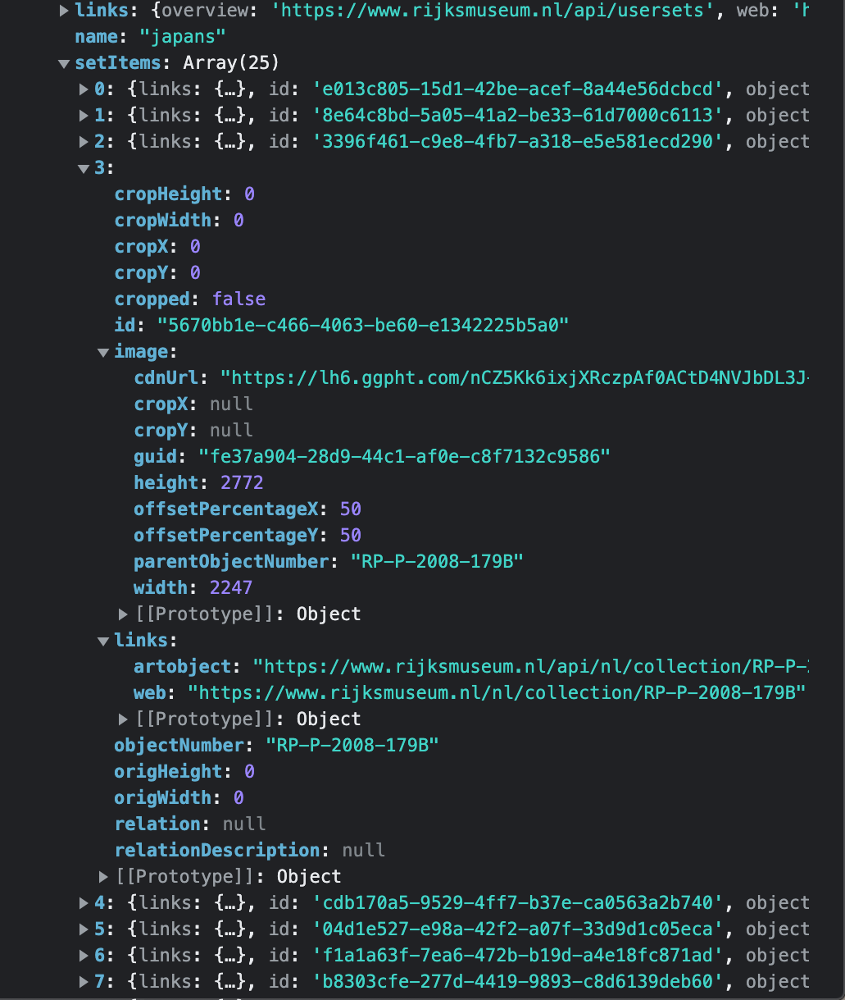

# Table of contents
1. [Introduction ](#introductionweek)
2. [Userstory](#userstory)
3. [Code](#codeexplanation)
4. [Checklist](#checklist)

Live preview: https://farrahton.github.io/WAFS-FarrahtonPiers/rijksmuseum/ 


# Introduction week <a name="introductionweek"></a>
## A little 'about me' booklet

https://farrahton.github.io/visitekaart/ 

## The team page I contributed to

https://gekkeboyjeff.github.io/frisbee-dashboard/week1/Geekotron/ 

# User Story for my SPA <a name="userstory"></a>
As an art lover, I want to be able to search and view art from the Rijksmuseum at home, so that I can still enjoy art during a lockdown Rijksmuseum - RijksData API


## Loading data from API
Retrieving data from Rijksmuseum requires getting your own unique API-key. From there on you can personalize the URL to retrieve the type of art you want the data from. 

# Code explanation <a name="codeexplanation"></a>

## Modules

App.js is the main file. It's where I imported all the other files. Let's walk through it:

## fetchArt

```js
import { fetchArt } from  "./modules/fetchArt.js";
```

This is the file that fetches two 'highlighted' Japanese artists for my website in the navigation bar. 

It starts with a few conts, which could be considered shortcuts. In the first one called artworksArtists a parameter is used to quickly 'manipulate' the url and insert another involvedMaker, so you don't have to create multiple fetches with only a small change in the url.

```js
${involvedMaker}
```
In the first part a response in json is fetched. While it's fetching a loading state is shown through adding a class list to hide the display. 
 
```js
fetch (artworksArtists)
    .then(function(response){
        loader.classList.add('hidden');
        console.log(response.status) 
        return response.status >= 200 && response.status <= 299 ? response.json() : console.log('error')  
    })
```

After the data is succesfully fetched it will render HTML to the corresponding selector paramater, which are hashes. (more about hashes later on)

If the WiFi for example turns off during the visit on the website or when you turn off the renderHTML import an error will be caught and an error state will be shown. I used catch for this and once again insertAdjacentHTML. Catch is a method used when a promise has been rejected and it is executed immediately after a promise's reject method is called.

```js
   .catch((error) => {
                loader.classList.add('hidden')
                console.log(error);
                errorState.insertAdjacentHTML(

                    "beforeend",
                     
                    ` <div class="error">
                    <h3> Er ging helaas iets fout. Probeer het opnieuw!<h3>
                    </div>
                    `
                );
            })
```

With the following line it will go to the next file with that exact function:

```js
 .then(function(items){
                renderHTML(items, selector);
            })
```


## RenderHTML
The previous step resulted in an array with data. Which meant I had to render HTML from it with the information I wanted to show on the website. To do this I had to make an event loop, so I could get every art object as oppossed to just the date from one singular array.

```js
for(let i = 0; i < artwork.length; i++) 
```

I created an ul in html and 'referenced' to it with the <code>$</code>, which is kind of an abbrivation for <code>document.querySelector</code>. 

The <code> ${selector}</code> parameter is used here too.The artworks will then become li's in HTML because of the insertAdjacentHTMl part. Also worth mentioning is that the slice part is used to change/optimize the size of the images.

```js
for(let i = 0; i < artwork.length; i++) {
        list.insertAdjacentHTML('afterbegin', `
        <li>
                
                <section>
                <h2>${artwork[i].title}</h2>   
                </section>
        </li>`)
    }
```

## Implementing UI stack states

<strong> Loading state </strong>>
One of the lectures was about the UI stack with multiple states. I tried to incorporate a loading state. At first I just used some display text for an HTML article :

```js
const display = document.querySelector('article');
display.textContent = 'We are loading for you'; 
``` 

However, I soon realized with this approach I was only displaying some text. Since visualizing stuff is more common nowadays I wanted to show a loading animation instead. That's why I created a simple CSS keyframe of a spinning circle and changed my JavaScript to add and remove a classList that changes it to CSS <code>display:hidden;</code> during the fetch and before the return of json so it will show up on the screen.

```js
    const loader = document.querySelector('#loaderContain');

    loader.classList.remove('hidden'); 

    loader.classList.add('hidden');

```

<strong> Error state </strong>
If there's no WiFi an error state will show up or when you turn off the renderHTML import in the fetchArt file for example. 
I used catch for this and once again <code>insertAdjacentHTML</code>. Catch is a method used when a promise has been rejected and it is executed immediately after a promise's reject method is called.


## Using hashes
I kind of realized too late that I approached the hash changes with CSS as opposed to JavaScript. Since small changes can cause big consequences in code I decided to keep it that way. Just in case though I'll tell you that I do know how it would work with JavaScript instead. It would be with an <code>addEventListener</code> and a <code>'click'</code>.

Currently I approached it in a 'reimagined progressive enhanced' way, according so smashingmagine.com.

The <code>:target</code> selector can be used to style the current active target element. 
The child selector <code>></code> selects all elements that are the children of a specified element.

https://www.smashingmagazine.com/2015/12/reimagining-single-page-applications-progressive-enhancement/ 
This is the article I used to create the navigation bar.

## Tried to filter with map

Since I have a Japanese themed art website I wanted to filter out the 'general' API URL 'https://www.rijksmuseum.nl/api/nl/collection/SK-C-5?key=[api-key]' to just the artobjects that were made in a specific place, which would obiously be Japan. In the array I could definitely go to the specific part with the following code:

```js
.then(data => {
    console.log(data.facets)
        let artwork = data.map(element => { 
            return { 
            artwork: element.facets[3].facets[14] }
          
```

However, the only thing in there is the key with the value Japan. I can't see any artObjects in there. So after involving Daan Kover and Robert Spier I gave up hope for this approach, since we came up with the conclusion that it isn't possible this way. 

But I am not a quitter, so I came up with something else. However, that too ended up not working for me... I wanted to use the user-generated content API. Figuring out how to even set up the URL the correct way took some time already. 

This is a regular link:
https://www.rijksmuseum.nl/en/rijksstudio/2513578--saraichi/collections/japans?ii=0&p=0 

This is the API link:
https://www.rijksmuseum.nl/api/nl/usersets/2513578-japans?key=9c1DbBQC&format=json

In the first one it's a number two dashes and then the <u> username</u> of the creator. In the second one you have to use the name of the <u>set</u> as opposed to the username. 

Then when i tried to renderHTML i found out that in the array you get from this approach there's only an image and no title of the artwork. Therefore, it's not really that useful for what i wanted to do. The only thing I might be able to do is use the ID of the <code>artObject</code> that is in the array to get that information.

 


## Activity diagram


## Search bar
Since I initially started with fetching URL with involed makers I had to use a different URL to fetch a bigger Rijksmuseum collection data base for the search bar. The approach for that is the same as the last fetch.

After that comes a function that uses the just mentioned fetch and its data. However it needs some differences in the URL. At the end of the url it needs <code>&q=</code> to add the search value.

Before we get into this new function we call on the <code>deleteResults();</code>, because when you search something you want the default pictures/old results to leave the page and have the new results at the top as opposed to having the new results be added underneath the old/default ones. To fix this I used the following function:

```js
function deleteResults() {
    let artworks = document.querySelectorAll('##home ul li') 

    artworks.forEach(artwork => {
        artwork.remove();
    })
}
```

After that we get into the actual searching part, wchich is actually pretty short, since the response.json and rendering part right after are also done with the same approach as before in fetchArt.js. The only thing that's new is the const I created that uses the URL const and adds <code>searchValue</code> to it.

```js
    const resultsData = dataSearchRijks + searchValue;
```

# Checklist <a name="checklist"></a>
<strong>Done</strong>
- [x] Learn to code in general
- [x] Fetch data
- [x] Render HTML
- [x] Multiple states
- [x] Navigation bar
- [x] Hashes
- [x] Search bar
- [x] Modules

<br>

<strong> Would do if i could/had the time/it's even possible </strong>
- [ ] Mapped data, so the searchbar would just search for values related to Japan
- [ ] When you click on an artwork you get more details
- [ ] Pagination to load more artworks
- [ ] Skeleton state
- [ ] Routie
- [ ] Error state for no results in search bar
- [ ] More esponsive

